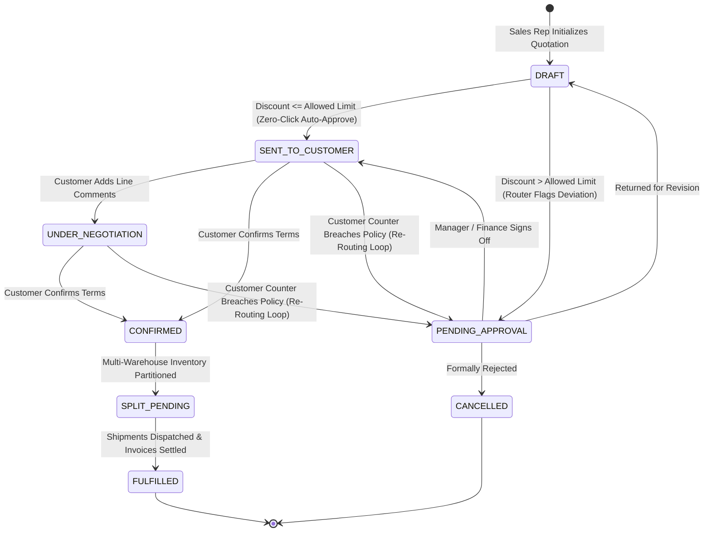
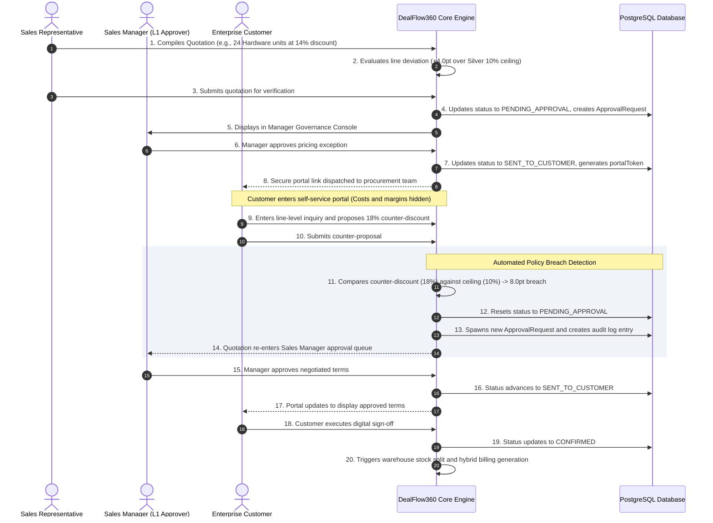
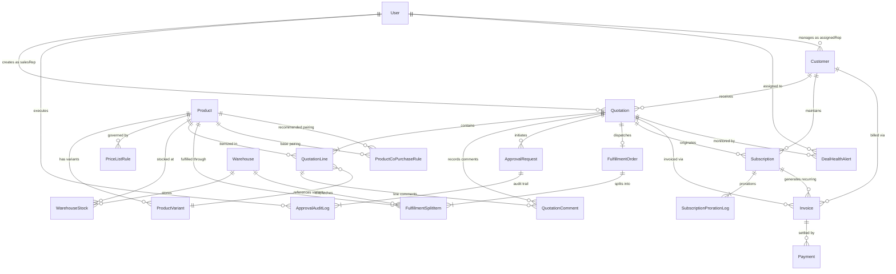

# DealFlow360
## Enterprise Autonomous CPQ and Sales Operations Platform

[](https://nodejs.org/)
[](https://nestjs.com/)
[](https://nextjs.org/)
[](https://www.postgresql.org/)
[](https://www.prisma.io/)
[](https://www.typescriptlang.org/)
[](https://www.docker.com/)
[](http://localhost:4000/api/docs)
[](scripts/verify-quick-flow.js)

---

### Table of Contents

1. [Executive Overview](#executive-overview)
2. [Core Platform Capabilities](#core-platform-capabilities)
3. [Autonomous Business Engines](#autonomous-business-engines)
4. [Enterprise System Architecture](#enterprise-system-architecture)
5. [In-Depth Database Specification](#in-depth-database-specification)
   - [5.1 Relational Entity-Relationship Diagram](#51-relational-entity-relationship-diagram)
   - [5.2 Mathematical Formulas and Governance Logic](#52-mathematical-formulas-and-governance-logic)
6. [Application Routes and Screen Architecture](#application-routes-and-screen-architecture)
7. [Enterprise Roles, Security, and Seed Data](#enterprise-roles-security-and-seed-data)
8. [REST API Gateway and Endpoint Catalog](#rest-api-gateway-and-endpoint-catalog)
9. [Installation, Configuration, and Verification](#installation-configuration-and-verification)
10. [Monorepo Structure](#monorepo-structure)
11. [Technical Documentation Index](#technical-documentation-index)
12. [Enterprise Scalability Roadmap](#enterprise-scalability-roadmap)
13. [Compliance and Architecture Standards](#compliance-and-architecture-standards)

---

## Executive Overview

DealFlow360 is a production-grade Configure, Price, Quote (CPQ), discount governance, multi-warehouse inventory allocation, and hybrid billing platform designed for high-volume B2B sales organizations.

Traditional enterprise resource planning (ERP) and customer relationship management (CRM) workflows treat quotations as static transactional documents. In complex enterprise sales environments, this static approach creates critical operational vulnerabilities:

* **Margin Degradation:** Unchecked line-level discounting leads to margin erosion without visibility into customer tier caps or category profitability constraints.
* **Fulfillment Inefficiency:** Orders covering physical hardware fail to account for fragmented warehouse inventory, resulting in shipment delays and inflated freight expenses.
* **Billing Reconciliation Overhead:** Mixed contracts containing physical hardware, one-time engineering services, and multi-interval recurring subscriptions require manual, error-prone invoicing adjustments.
* **Governance Gaps During Negotiation:** Customer counter-proposals submitted during negotiations bypass formal managerial review when conducted over informal communication channels.

DealFlow360 resolves these challenges by converting quotations into automated, self-governing deal engines that enforce dual-ceiling governance, automate multi-depot fulfillment routing, compute calendar-day subscription prorations, and re-route policy-breaching counter-offers into managerial approval pipelines.

---

## Core Platform Capabilities

| Operational Domain | Traditional Sales and ERP Systems | DealFlow360 Enterprise Platform |
| :--- | :--- | :--- |
| **Discount Governance** | Post-deal manager audits and manual spreadsheet sign-offs | Real-time dual-ceiling evaluation with automatic multi-tier routing |
| **Customer Negotiations** | Unmonitored email communications and manual re-quoting | Dynamic customer portal with automated policy breach re-routing |
| **Inventory Fulfillment** | Manual warehouse picker assignment and order batching | Automated cost-weighted multi-depot splitting with backorder pools |
| **Hybrid Invoicing** | Manual creation of separate one-time and SaaS invoices | Automated split generation of Net 30 invoices and recurring contracts |
| **Mid-Cycle Amendments** | Approximation and manual reconciliation of prorated charges | Exact calendar-day proration ledger tracking seat adjustments |
| **Deal Surveillance** | Periodic retrospective pipeline reviews | Continuous deal health monitoring flagging stalled quotes and rep anomalies |

---

## Autonomous Business Engines

### 1. Multi-Tier Discount Governance and Zero-Click Routing

DealFlow360 evaluates all quotation line items against two concurrent boundary constraints:
* **Customer Tier Ceilings:** Configurable threshold based on account relationship (`Bronze: 5.0%`, `Silver: 10.0%`, `Gold: 15.0%`).
* **Product Category Ceilings:** Profitability bounds enforced per product classification (`Hardware: 15.0%`, `Services: 10.0%`, `Subscription: 15.0%`).

The system calculates allowable discount thresholds using the formula:
$$\text{AllowedLimit} = \min(\text{TierCeiling}[\text{CustomerTier}],\ \text{CategoryCeiling}[\text{ProductCategory}])$$

* **Zero-Click Auto-Approval:** If all line items comply with allowable limits ($\text{Deviation} = 0$), the quotation is approved automatically and transitioned directly to `SENT_TO_CUSTOMER`.
* **Single-Tier Manager Review:** If the maximum line deviation is within $5.0\%$ points, the quotation is routed to the Sales Manager queue (`PENDING_APPROVAL`).
* **Two-Tier Sequential Review:** If the maximum line deviation exceeds $5.0\%$ points or breaches margin floors, the engine enforces sequential review: Sales Manager (L1) followed by Finance Controller (L2).

### 2. Dynamic Negotiation Loop and Policy Breach Re-Routing

When a quotation is published, the external customer receives tokenized, secure access to a dedicated collaboration portal (`/portal/quote/:token`). Internal cost structures, base costs, and target margin percentages are completely masked from this view.

If a customer submits a counter-discount proposal that breaches policy limits:
1. The quotation state immediately drops from `SENT_TO_CUSTOMER` or `UNDER_NEGOTIATION` back to `PENDING_APPROVAL`.
2. A formal `ApprovalRequest` record is generated with computed risk metrics and audit logging.
3. The deal re-enters the managerial governance queue. The customer portal locks against final confirmation until an authorized manager reviews and approves the counter-offer.

### 3. Cost-Weighted Multi-Warehouse Inventory Splitting

When an order is confirmed, physical hardware lines are evaluated by the fulfillment engine against real-time warehouse inventory:
* **Single-Depot Fast Path:** If any single facility possesses sufficient stock to fulfill 100% of the physical requirement, the order is allocated to that warehouse to minimize split-shipment overhead.
* **Greedy Multi-Depot Partitioning:** If no single facility can satisfy the demand, the engine allocates inventory across distributed depots using shipping cost weight multipliers.
* **Automated Backorder Allocation:** If the aggregate network inventory cannot fulfill the total requirement, available stock is allocated immediately and the deficit is segregated into an active `BACKORDER` record.

### 4. Hybrid Billing and Calendar-Day Proration Engine

DealFlow360 partitions confirmed orders containing mixed line types into synchronized commercial streams:
* **One-Time Commercial Invoices:** Standard commercial invoices with Net 30 payment terms generated for hardware and one-time professional services lines.
* **Recurring Subscription Contracts:** Multi-interval recurring contracts (`WEEKLY`, `MONTHLY`, `QUARTERLY`, `YEARLY`) generated with Net 15 initial invoices and automated renewal cycles.
* **Calendar-Day Mid-Cycle Proration:** When subscription seat counts or license volumes are altered mid-billing cycle, the proration engine calculates exact unbilled fractions:
  $$\text{ProratedDelta} = \left(\frac{\text{DaysRemaining}}{\text{CycleDays}}\right) \times (\text{NewRecurringAmount} - \text{OldRecurringAmount})$$
  Every financial amendment is logged immutably in the `SubscriptionProrationLog`.

### 5. Deal Health Surveillance and Discount Anomaly Intelligence

A background surveillance service continuously monitors the active sales pipeline:
* **Stalled Deal Detection:** Flags quotations with zero recorded activity for more than 7 consecutive days.
* **Sales Rep Discount Anomalies:** Identifies deal lines where requested discounts exceed the account's historical average by more than $1.5\times$.
* **Managerial Nudge Infrastructure:** Enables managers to issue direct audit comments and notifications to assigned sales representatives from within the governance console.

---

## Enterprise System Architecture

```mermaid
flowchart TB
    subgraph PresentationTier ["Client Presentation Layer (Next.js 14 / Port 3000)"]
        PublicPortal["Customer Collaboration Portal<br/><code>/portal/quote/:token</code><br/><i>Masked Cost & Margin Architecture</i>"]
        InternalConsole["Internal Operations Console<br/><code>/dashboard</code>, <code>/quotations</code>, <code>/approvals</code><br/><i>Role-Based Views: Rep, Manager, Finance, Admin</i>"]
    end

    subgraph APIGatewayTier ["API Gateway & Business Logic Layer (NestJS 10 / Port 4000)"]
        RBACModule["Auth & RBAC Guards<br/>Argon2 | JWT Access & Refresh"]
        CPQModule["CPQ Quotation Engine<br/>Real-Time Margin % & Policy Boundary Checks"]
        UpsellModule["AI Recommendation Engine<br/>Co-Purchase Affinity Scoring & Margin Optimization"]
        GovernanceModule["Approval Governance Engine<br/>Sequential L1 Manager -> L2 Finance Routing"]
        FulfillmentModule["Logistics Split Engine<br/>Greedy Depot Cost Optimization & Backorders"]
        BillingModule["Hybrid Billing & Proration<br/>Split Invoicing & Calendar-Day Proration"]
        SurveillanceModule["Pipeline Surveillance<br/>Stalled Deals (>7d) & Rep Discount Anomalies"]
    end

    subgraph DataTier ["Persistence & Infrastructure Layer"]
        PostgreSQL[(PostgreSQL 16 Enterprise Database<br/>Prisma ORM 5.22<br/><i>25 Relational Models | 13 Enums</i>)]
        RedisCache[(Redis Cache & Rate Limiting Engine)]
        NotificationService[SMTP Transactional Mail Service<br/>OTP Challenge & Portal Magic Links]
    end

    PublicPortal -->|"Tokenized Public REST"| CPQModule
    PublicPortal -->|"Counter Proposal Breach"| GovernanceModule
    InternalConsole -->|"Bearer JWT (Role Enforced)"| RBACModule
    RBACModule --> CPQModule
    RBACModule --> GovernanceModule
    RBACModule --> FulfillmentModule
    RBACModule --> BillingModule
    RBACModule --> SurveillanceModule

    CPQModule --> UpsellModule
    CPQModule --> PostgreSQL
    GovernanceModule --> PostgreSQL
    FulfillmentModule --> PostgreSQL
    BillingModule --> PostgreSQL
    SurveillanceModule --> PostgreSQL
    RBACModule --> RedisCache
    RBACModule --> NotificationService
```

---

### Quotation Lifecycle State Machine



---

### Customer Negotiation and Policy Enforcement Workflow



---

## In-Depth Database Specification

DealFlow360 operates on **PostgreSQL 16** via **Prisma ORM 5.22**. The schema defines **25 relational models** and **13 custom database enums**, enforcing strict referential integrity, foreign key cascading strategies, and composite indexing.

### 5.1 Relational Entity-Relationship Diagram



---

### 5.2 Mathematical Formulas and Governance Logic

#### 1. Dual-Ceiling Allowed Limit and Line Over-Limit Points
$$\text{AllowedLimit} = \min(\text{TierDiscountCeiling}[\text{CustomerTier}],\ \text{CategoryDiscountCeiling}[\text{ProductCategory}])$$
$$\text{OverLimitPoints} = \max(0.0,\ \text{DiscountPercent} - \text{AllowedLimit})$$

#### 2. Real-Time Gross Margin Percentage
$$\text{LineGross} = \text{UnitPrice} \times \text{Quantity}$$
$$\text{LineDiscount} = \text{LineGross} \times \left(\frac{\text{DiscountPercent}}{100}\right)$$
$$\text{LineTotal} = \text{LineGross} - \text{LineDiscount}$$
$$\text{LineCostTotal} = \text{UnitCost} \times \text{Quantity}$$
$$\text{LineMarginPercent} = \begin{cases} 
\left(\frac{\text{LineTotal} - \text{LineCostTotal}}{\text{LineTotal}}\right) \times 100 & \text{if } \text{LineTotal} > 0 \\
0.0 & \text{otherwise}
\end{cases}$$

#### 3. Order Valuation and Blended Risk Score
$$\text{OrderDiscountValue} = (\text{Subtotal} - \text{TotalLineDiscounts}) \times \left(\frac{\text{OrderDiscountPercent}}{100}\right)$$
$$\text{FinalAmount} = \text{Subtotal} - (\text{TotalLineDiscounts} + \text{OrderDiscountValue})$$
$$\text{TotalMarginPercent} = \left(\frac{\text{FinalAmount} - \text{TotalCost}}{\text{FinalAmount}}\right) \times 100$$
$$\text{WorstLineDeviation} = \max_{\text{lines}}(\text{OverLimitPoints})$$
$$\text{CumulativeDeviation} = \sum_{\text{lines}}(\text{OverLimitPoints}) + \text{OrderDiscountPercent}$$
$$\text{EffectiveDeviation} = \max(\text{WorstLineDeviation},\ \text{CumulativeDeviation})$$
$$\text{RiskLevel} = \begin{cases}
\mathbf{LOW} & \text{if } \text{EffectiveDeviation} = 0.0 \implies \text{Zero-Click Auto-Approve} \\
\mathbf{MEDIUM} & \text{if } 0.0 < \text{EffectiveDeviation} \le 5.0 \implies \text{Sales Manager (L1)} \\
\mathbf{HIGH} & \text{if } \text{EffectiveDeviation} > 5.0 \implies \text{Sales Manager} \to \text{Finance (L2)}
\end{cases}$$

#### 4. Warehouse Fulfillment Allocation Cost
$$\text{EstimatedShippingCost} = \text{AllocatedUnits} \times \$10.00 \times \text{ShippingCostWeight}$$

#### 5. Mid-Cycle Proration Adjustment
$$\text{DaysRemaining} = \max\left(0,\ \left\lceil \frac{\text{NextBillingDate} - \text{ChangeDate}}{86400000} \right\rceil\right)$$
$$\text{ProratedDeltaAmount} = \left(\frac{\text{DaysRemaining}}{\text{CycleDays}}\right) \times (\text{NewRecurringAmount} - \text{OldRecurringAmount})$$

---

## Application Routes and Screen Architecture

The frontend is implemented using **Next.js 14 App Router** and **Tailwind CSS**, providing dedicated operational consoles for each organizational role:

| Screen # | Module Designation | Route Path | Authorized Roles | Operational Description |
| :---: | :--- | :--- | :--- | :--- |
| **01** | **Authentication Gateway** | `/auth` | Public / All | JWT credential login, two-factor OTP challenge, customer portal redirection. |
| **02** | **Executive Dashboard** | `/dashboard` | Internal Roles | High-level operational KPIs (Active Opportunities, Total Pipeline, Win Rate). |
| **03** | **Quotation Pipeline (Kanban)** | `/quotations` | Rep, Manager, Admin | 5-stage interactive pipeline Kanban with risk indicators and rep filters. |
| **04** | **CPQ Quotation Cart** | `/quotations/[id]` | Rep, Manager | Real-time line item CPQ, live margin recalculation, 1-click AI upsell drawer. |
| **05** | **Approval Governance Queue** | `/approvals` | Manager, Finance | Centralized approval inbox filtering deals by risk tier (`MEDIUM` / `HIGH`). |
| **06** | **Approval Detail & Audit** | `/approvals/[id]` | Manager, Finance | Policy deviation breakdown, line-item deviation audit, Approve/Return/Reject. |
| **07** | **Inventory & Stock Console** | `/fulfillment` | Ops, Finance, Admin | Cross-depot inventory visibility (InStock, Reserved, Available) and order splits. |
| **08** | **Warehouse Split Detail** | `/fulfillment/[id]`| Ops, Finance, Admin | Split-shipment inspector, freight calculation, Manual override controls. |
| **09** | **Subscription Management** | `/subscriptions` | Finance, Admin | Active, Paused, and Cancelled recurring MRR contracts and renewal schedules. |
| **10** | **Subscription Proration Console** | `/subscriptions/[id]`| Finance, Admin | Mid-cycle seat/unit modification console with real-time calendar-day proration. |
| **11** | **Customer Collaboration Portal** | `/portal/quote/[token]`| **Customer (Tokenized)**| Masked quote presentation (costs hidden), line inquiries, counter-offer form. |
| **12** | **Invoicing & Receivables** | `/invoices` | Finance, Admin | Split commercial invoice ledger (One-Time Net 30 vs Recurring SaaS cycles). |
| **13** | **Invoice Detail & Payment** | `/invoices/[id]` | Finance, Admin | Order-to-Cash progress tracker, Record Payment modal (Wire, ACH, Card). |
| **14** | **Deal Health & Surveillance** | `/health` | Manager, Admin | Pipeline surveillance detecting stalled deals (>7d), rep anomalies, 1-click Nudge. |
| **15** | **Executive Reports & Export** | `/reports` | Manager, Admin | Financial summaries by tier/category, 1-click **Export CSV** and **Printable PDF**. |
| **16** | **Catalog Management** | `/products` | Rep, Admin | Enterprise item master directory with SKU search, unit costs, and pricing. |
| **17** | **Product & Variant Editor** | `/products/[id]` | Admin | Base cost and selling price editor, tax rates, variant attribute generator. |
| **18** | **Discount Governance Setup** | `/governance` | Admin | Tier ceilings, category boundaries, and sequential approval chain matrix. |

---

## Enterprise Roles, Security, and Seed Data

### Role-Based Access Control (RBAC) Matrix

| System Role | Portal Access | CPQ Cart | Governance Approvals | Fulfillment & Stock | Subscriptions & Billing | System Governance Matrix |
| :--- | :---: | :---: | :---: | :---: | :---: | :---: |
| **Sales Representative** | No | Read / Write | No (Submit only) | Read Only | Read Only | Read Only |
| **Sales Manager** | No | Read / Write | Level 1 (L1) | Read Only | Read Only | Read Only |
| **Finance Controller** | No | Read Only | Level 2 (L2) | Read / Override | Read / Write | Read Only |
| **System Administrator** | No | Full Access | Full Access | Full Access | Full Access | Full Access |
| **Enterprise Customer** | Restricted | No | Counter-Offer | No | Invoices Only | No |

### Pre-Configured Demonstration Accounts

All demonstration accounts are provisioned with the standard initial password: `123456`.

* **System Administrator:** `admin@dealflow.com` (Aniket Dabhi — Executive Administration)
* **Sales Representative:** `rep@dealflow.com` (J. Rao — Direct Sales Account Executive)
* **Senior Account Executive:** `sarah.rep@dealflow.com` (Sarah Chen — Strategic Accounts)
* **Sales Manager (L1 Approver):** `manager@dealflow.com` (M. Shah — Commercial Sales Director)
* **Finance Controller (L2 Approver):** `finance@dealflow.com` (R. Iyer — Revenue Operations Controller)
* **Enterprise Customer:** `customer@dealflow.com` (Valued Enterprise Procurement Partner)

---

## REST API Gateway and Endpoint Catalog

Interactive OpenAPI (Swagger) documentation is exposed at:  
**`http://localhost:4000/api/docs`**

```text
AUTHENTICATION AND SESSION MANAGEMENT
POST   /api/auth/login                       - Authenticate user credentials and return JWT tokens
POST   /api/auth/signup                      - Register new user profile with OTP verification
GET    /api/auth/me                          - Retrieve authenticated user session details

CUSTOMER MASTER DIRECTORY
GET    /api/customers                        - List enterprise accounts with tiers and discount averages
POST   /api/customers                        - Register new customer master record
GET    /api/customers/:id                    - Retrieve customer dossier and historical quotation log

PRODUCT CATALOG AND PRICING
GET    /api/products                         - Query catalog items with stock availability and variants
POST   /api/products                         - Provision new product SKU (Admin)
GET    /api/products/:id                     - Product specifications and tier pricing matrix
POST   /api/products/:id/variants            - Provision variant attribute (RAM, Storage, CPU)

DISCOUNT GOVERNANCE MATRIX
GET    /api/discount-rules                   - Retrieve tier ceilings, category limits, and approval matrix
PUT    /api/discount-rules/tier-ceiling      - Update customer tier maximum discount ceiling
PUT    /api/discount-rules/category-ceiling  - Update product category maximum discount ceiling
PUT    /api/discount-rules/approval-matrix   - Configure risk-level sequential review requirements

CPQ QUOTATION ENGINE
GET    /api/quotations                       - List quotations (filterable by stage, sales rep, customer)
POST   /api/quotations                       - Initialize new draft quotation
GET    /api/quotations/:id                   - Full quotation detail with calculated line items
PUT    /api/quotations/:id/lines             - Synchronize line items, discounts, and margins
POST   /api/quotations/:id/submit            - Execute zero-click approval risk router
GET    /api/quotations/:id/upsell-suggestions- Query co-purchase recommendations with margin deltas
POST   /api/quotations/:id/lines/upsell      - Add recommended cross-sell item to quotation

APPROVAL GOVERNANCE
GET    /api/approvals                        - Retrieve pending approval queue filtered by role
GET    /api/approvals/:id                    - Retrieve deviation analysis and audit history
POST   /api/approvals/:id/action             - Execute decision: Approve, Return for Revision, or Reject

CUSTOMER COLLABORATION PORTAL (TOKENIZED)
GET    /api/portal/quote/:token              - Retrieve customer-safe quotation (costs/margins masked)
POST   /api/portal/quote/:token/comment      - Submit customer line-level inquiry
POST   /api/portal/quote/:token/counter      - Propose counter-discount (Policy breach re-routing loop)
POST   /api/portal/quote/:token/confirm      - Execute electronic sign-off and confirm quotation

MULTI-WAREHOUSE FULFILLMENT
GET    /api/fulfillments/warehouses/stock    - Query real-time available inventory across facilities
POST   /api/fulfillments/quotation/:id/split - Compute greedy cost-weighted inventory split
POST   /api/fulfillments/:id/override        - Apply manual allocation override across depots

HYBRID BILLING AND PRORATION
POST   /api/invoices/generate-from-quotation/:id - Generate split One-Time and Recurring invoices
GET    /api/invoices                         - Query commercial invoice ledger
POST   /api/invoices/:id/pay                 - Record settlement payment against invoice
GET    /api/subscriptions                    - Query active recurring subscription contracts
POST   /api/subscriptions/:id/adjust-quantity- Adjust subscription seats with calendar-day proration
POST   /api/subscriptions/:id/cancel         - Terminate contract with prorated refund calculation

DEAL HEALTH SURVEILLANCE AND REPORTING
GET    /api/analytics/dashboard-metrics      - Retrieve pipeline volume, win rate, and pending counts
GET    /api/analytics/deal-health            - Surveillance alerts for stalled deals and rep anomalies
POST   /api/analytics/nudge                  - Dispatch manager nudge alert into quotation audit trail
GET    /api/analytics/reports                - Financial revenue reports aggregated by tier and category
GET    /api/analytics/export/csv             - Export complete sales pipeline as CSV spreadsheet
GET    /api/analytics/export/pdf             - Generate executive printable PDF pipeline report
```

---

## Installation, Configuration, and Verification

### 1. Prerequisites
* **Node.js**: `v18.0.0` or higher
* **Package Manager**: `pnpm` (`npm install -g pnpm`)
* **Container Engine**: Docker Desktop or Docker Engine with Docker Compose

### 2. Service Deployment

```bash
# 1. Clone repository and install dependencies
git clone https://github.com/your-org/dealflow360.git
cd dealflow360
pnpm install

# 2. Launch containerized PostgreSQL 16 and Redis services
pnpm up

# 3. Synchronize database schema and seed demonstration data
pnpm seed
```

### 3. Running Development Servers

```bash
# Terminal 1: Launch NestJS API Gateway (Port 4000)
pnpm dev:backend

# Terminal 2: Launch Next.js Operations Console (Port 3000)
pnpm dev:frontend

# Or launch both concurrently:
pnpm dev
```

### 4. End-to-End Flow Verification Suite

The repository includes an automated end-to-end test runner verifying all 8 core business logic workflows against live database entities:

```bash
pnpm test:flow
```

---

## Monorepo Structure

```text
dealflow360/
├── apps/
│   ├── backend/                     # NestJS 10 REST API Server
│   │   ├── prisma/
│   │   │   ├── schema.prisma        # 25 Relational Models & 13 Enums
│   │   │   └── seed.ts              # Database Seeder (Users, Products, Rules)
│   │   └── src/
│   │       ├── analytics/           # Deal Health Surveillance & Reporting
│   │       ├── approvals/           # Multi-Tier Approval Engine & Audit Trail
│   │       ├── auth/                # JWT Auth, OTP Signup & Password Reset
│   │       ├── customers/           # Customer Master & Tier Management
│   │       ├── discount-rules/      # Dual Discount Ceilings & Approval Matrix
│   │       ├── fulfillments/        # Multi-Warehouse Split & Backordering
│   │       ├── invoices/            # Hybrid Split Invoicing & Settlements
│   │       ├── portal/              # Customer Collaboration Portal
│   │       ├── products/            # Catalog, Variants & Pricelists
│   │       ├── quotations/          # CPQ Engine, Margin Math & AI Upsell
│   │       └── subscriptions/       # MRR Contracts & Calendar-Day Proration
│   └── frontend/                    # Next.js 14 App Router UI Console
│       └── src/
│           ├── app/                 # 18 Role-Based Application Screens
│           ├── components/          # Design System Components & Modals
│           ├── context/             # AuthContext & Session Store
│           └── services/            # Axios API Gateway Client
├── docs/                            # Enterprise Architecture Specifications
│   ├── architecture_and_data_model.md # Technical Architecture & Data Model Spec
│   ├── api_quickstart_for_frontend.md # Frontend API Integration Specification
│   ├── execution_plan.md            # Platform Execution & Systems Design Plan
│   ├── flow.md                      # End-to-End Workflow & Route Specification
│   ├── setup.md                     # Infrastructure Provisioning Runbook
│   └── what_we_would_build_next.md  # Scalability & Systems Extension Roadmap
├── infra/
│   └── docker-compose.yml           # PostgreSQL 16 & Redis Services
├── scripts/
│   ├── seed-comprehensive-demo-data.js # Rich Persona & Enterprise Data Seeder
│   ├── verify-db-counts.js          # Database Record Count Auditor
│   └── verify-quick-flow.js         # Automated Verification Script
├── Makefile                         # Unified Developer Make Commands
├── package.json                     # Monorepo Workspace Configuration
└── README.md                        # Primary Documentation
```

---

## Technical Documentation Index

For detailed architectural and integration documentation, refer to the following specifications:

* [Architecture and Data Model Specification](docs/architecture_and_data_model.md): Detailed entity-relationship specifications, state machines, and system boundary designs.
* [System Workflow and Route Architecture](docs/flow.md): Comprehensive routing matrix mapping all 18 screens to backend services.
* [Frontend API Integration Guide](docs/api_quickstart_for_frontend.md): Integration quickstart, DTO contracts, and authentication protocols.
* [Infrastructure Setup Runbook](docs/setup.md): Complete setup instructions for containerized environments.
* [Platform Execution Plan](docs/execution_plan.md): Architectural roadmap and verification criteria.

---

## Enterprise Scalability Roadmap

1. **Multi-Currency and Real-Time FX Rate Hedging:**
   * Dynamic exchange rate synchronization via banking and rate APIs.
   * FX volatility margin buffers for 30-day quotation price guarantees on cross-border transactions.
   * Multi-entity regional tax calculation engines (VAT, GST, and US State Sales Tax compliance).
2. **Spatial Routing and Logistics Telematics:**
   * Integration with Mapbox and Google Maps Distance Matrix APIs to calculate freight rates and transit times at checkout.
   * Carbon footprint scoring across fulfillment alternatives for environmental compliance.
3. **Machine Learning Price Optimization and Win Probability:**
   * Collaborative filtering and `pgvector` embeddings on historical win/loss data to predict deal closure probabilities at varying discount levels.
   * Automated subscription churn risk modeling based on portal engagement cadence.
4. **Bi-Directional ERP Connectors:**
   * Standard XML-RPC and JSON-RPC connectors for bi-directional synchronization with ERP Sales, Inventory, and Accounting modules.
   * Automated webhook handlers for Stripe, Adyen, and SEPA direct debit payment processing.
5. **Real-Time Collaborative Quoting:**
   * Multi-user WebRTC presence allowing concurrent quote editing between enterprise sales teams and procurement leads.
   * Cryptographically verified electronic signature integration via DocuSign and HelloSign APIs.

---

## Compliance and Architecture Standards

* **Architecture:** Enterprise Monorepo (NestJS / Next.js / PostgreSQL / Prisma).
* **Audit Standard:** Implements immutable, SOX-compliant append-only logs for all discount approvals and subscription proration adjustments.
