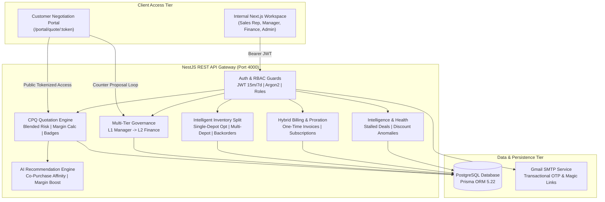
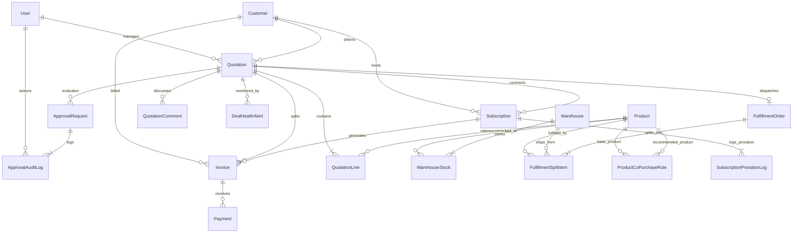
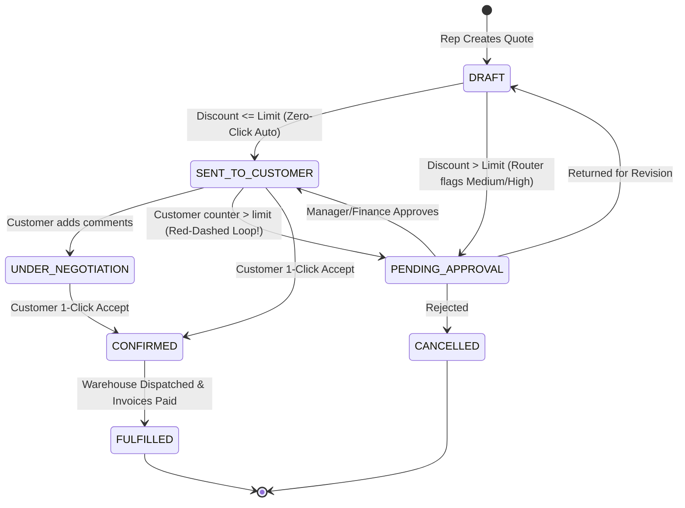

# DealFlow360 — Architecture & Data Model

> **Odoo Grand Finale Hackathon Deliverable #3**  
> An Intelligent, Self-Governing Sales Operations & CPQ Platform

---

## 1. System Architecture Overview

---

## 2. Core Entity-Relationship Diagram (ERD)

---

## 3. The 3 Core Autonomous Business Engines

### Engine 1: Multi-Line Blended Risk Calculation (A3 Notes)
$$\text{AllowedLimit} = \min(\text{TierCeiling}, \text{CategoryCeiling})$$
$$\text{LineOverLimit} = \max(0, \text{DiscountPercent} - \text{AllowedLimit})$$
$$\text{MaxDeviation} = \max_{\text{all lines}}(\text{LineOverLimit})$$
* If $\text{MaxDeviation} == 0 \implies \mathbf{LOW\ RISK} \implies$ **Zero-Click Auto-Approve** $\to$ `SENT_TO_CUSTOMER`.
* If $0 < \text{MaxDeviation} \le 5.0\% \implies \mathbf{MEDIUM\ RISK} \implies$ Route to **Sales Manager** queue.
* If $\text{MaxDeviation} > 5.0\% \implies \mathbf{HIGH\ RISK} \implies$ Route to **Two-Tier (Sales Manager $\to$ Finance Controller)**.

### Engine 2: The Red-Dashed Re-Approval Loop (B8)
When a customer uses the portal to submit a Counter-Discount:
1. System evaluates counter-discount against tier ceiling.
2. If limit breached: Quotation status immediately resets to `PENDING_APPROVAL`, audit log is created, and quote re-enters manager's queue.
3. Once approved, portal refreshes and customer can execute 1-click confirmation.

### Engine 3: Multi-Warehouse Auto-Split & Optimization (B6)
1. Fetches real-time available stock across all active facilities.
2. Checks if primary warehouse can fulfill 100% of order with 1 shipment.
3. If not, partitions line across closest facilities using shipping cost weighting.
4. If total inventory across all depots is insufficient, reserves available stock and flags remaining deficit as `BACKORDER`.
5. Mid-fulfillment stock arrival triggers "Consolidate Remaining Backorder" workflow.

---

## 4. State Machine: Quotation Lifecycle

