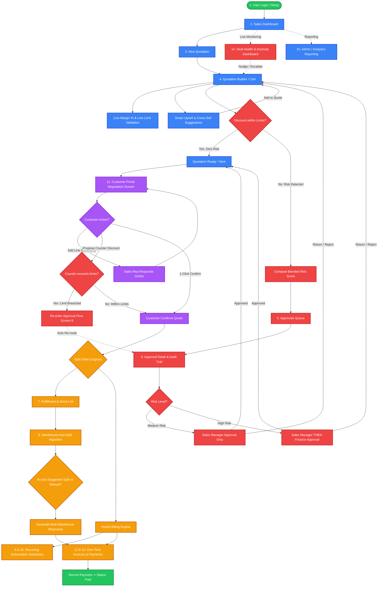
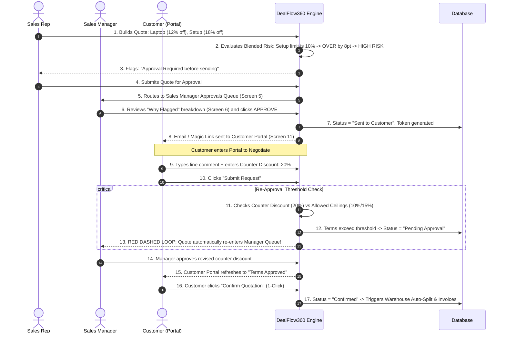
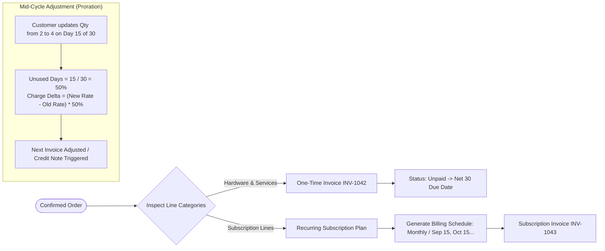

# DealFlow360 — End-to-End System Flow, Roles & Architecture

## 1. User Roles & Responsibilities Matrix

| Role | Access Scope | Screens | Core Responsibilities |
| :--- | :--- | :--- | :--- |
| **Sales Rep** | Internal Workspace | `1`, `2`, `3`, `4`, `11` (view msgs) | • Builds quotations across Hardware, Services, Subscriptions.<br>• Inputs line-level & order-level discounts.<br>• Views real-time Margin % and accepts Upsell/Cross-sell recommendations.<br>• Submits quotes exceeding limits for approval.<br>• Communicates with customer over portal messages. |
| **Sales Manager** *(Approver L1)* | Internal Workspace + Governance | `2`, `5`, `6`, `14`, `15` | • Reviews quotations flagged with MEDIUM/HIGH risk.<br>• Approves, rejects, or returns quotes with comments & audit log.<br>• Monitors Deal Health Dashboard (Stalled deals, Rep discount anomalies).<br>• Triggers "Nudge Rep" or "Escalate". |
| **Finance / Operations** *(Approver L2)* | Internal Workspace + Fulfillment & Billing | `5`, `6`, `7`, `8`, `9`, `10`, `12`, `13` | • Second-level approval for HIGH-risk discount quotes.<br>• Reviews and accepts/overrides multi-warehouse stock fulfillment splits.<br>• Reconciles recurring subscription schedules and mid-cycle prorations.<br>• Validates invoices, records payments, and handles credit notes. |
| **Customer** *(Portal User)* | External Restricted Portal (`/portal/:token`) | `1` (magic link/login), `11` | • Views quotation online without seeing internal cost/margins.<br>• Submits line-level comments and questions.<br>• Enters Counter Discount % and requested delivery dates.<br>• Confirms final quote with 1-click (re-triggers approval if limit exceeded). |
| **Admin** | System-Wide Configuration | `16`, `17`, `18`, `2`, `15` | • Manages Products, Variants (RAM, Color), Base Costs, Selling Prices.<br>• Configures Customer Tiers (Bronze, Silver, Gold) and Pricelists.<br>• Configures Discount Ceilings (Tier + Category) & Approval Chain Rules.<br>• Sets up Warehouses, Stock levels, Shipping weights, and Recurring Plans. |

---

## 2. Complete Routes Architecture

### 2.1 Frontend Client Routes (Mapped to Screens 1–18)

| Route Path | Screen # | Screen Name | Role Access | Key Features / Views |
| :--- | :---: | :--- | :--- | :--- |
| `/login` | **1** | Login / Signup | All | Credential login, magic link, customer portal entry |
| `/dashboard` | **2** | Sales Dashboard / Home | Internal | Pending Approvals, Open Quotes, At-Risk Deals, Quick Action buttons |
| `/quotations` | **3** | Quotations List & Kanban | Rep, Manager, Admin | 5 Stages: Draft, Pending Approval, Approved, Negotiation, Confirmed |
| `/quotations/:id` | **4** | Quotation Builder (Cart) | Rep, Manager | Line items, Live Margin %, Limit Check (OK / OVER), Upsell side panel |
| `/approvals` | **5** | Approvals List | Manager, Finance | Counters (Pending/Returned/Approved), Table with Blended Risk badges |
| `/approvals/:id` | **6** | Approval Detail & Governance | Manager, Finance | "Why This Quote Was Flagged", Stepper, Audit trail, Approve/Return/Reject |
| `/fulfillment` | **7** | Fulfillment & Stock List | Ops, Finance, Admin | Warehouse stock (In Stock/Reserved/Available), Orders Awaiting Split |
| `/fulfillment/:id` | **8** | Fulfillment Detail (Split) | Ops, Finance | Recommended split table, shipping cost, Accept Split, Manual Override |
| `/subscriptions` | **9** | Subscriptions List | Finance, Admin | Active/Paused/Cancelled plans, Customer, Cycle, Next Bill Date |
| `/subscriptions/:id` | **10**| Billing Detail | Finance, Admin | One-Time lines vs Recurring lines, Modify subscription, Proration log |
| `/portal/quote/:token`| **11**| Customer Portal Negotiation | **Customer** (Restricted) | Quotation breakdown, Line comments, Counter Discount %, Confirm Quote |
| `/invoices` | **12**| Invoices List | Finance, Admin | Unpaid/Paid counts, Due dates, One-time vs Subscription invoices |
| `/invoices/:id` | **13**| Invoice Detail & Payment | Finance, Admin | Stepper (Confirmed $\rightarrow$ Shipped $\rightarrow$ Invoiced $\rightarrow$ Paid), Record Payment |
| `/deal-health` | **14**| Deal Health & Anomaly | Manager, Admin | Stalled Deals (>7d), Rep Discount Anomalies, Delivery Slippage, Nudge |
| `/reports` | **15**| Admin / Reporting | Manager, Admin | Period/Rep/Status/Category filters, KPIs, Export PDF, Export XLS |
| `/products` | **16**| Product Catalog Dashboard | Admin, Rep | Product list, variants count, price lists, stock on hand |
| `/products/:id` | **17**| Product Details & Pricelist | Admin | General Info, Cost, Tax, Subscription toggle, Variants table |
| `/config/discounts`| **18**| Discount Tiers & Rules | Admin | Tier ceilings, Category ceilings, Approval routing matrix |

---

### 2.2 Backend REST API Endpoints

```text
AUTH & USER MANAGEMENT (Admin & Roles)
POST   /api/auth/login                       -> Authenticate internal users
POST   /api/auth/signup                      -> Internal / Customer account creation
GET    /api/auth/me                          -> Current user profile & permissions
GET    /api/users                            -> List all users & assigned roles (Admin)
POST   /api/users                            -> Admin creates employee & assigns role (Rep/Manager/Finance)
PATCH  /api/users/:id/role                   -> Admin updates user role

CUSTOMERS & TIERS
GET    /api/customers                        -> List customers with tier & historical avg discount
POST   /api/customers                        -> Create new customer master
GET    /api/customers/:id                    -> Customer details & quotation history

MASTER DATA & CATALOG
GET    /api/products                         -> List catalog items with stock & variants
POST   /api/products                         -> Create product (Admin)
GET    /api/products/:id                     -> Product details with variants & pricing rules
PUT    /api/products/:id                     -> Update product details
POST   /api/products/:id/variants            -> Add variant (Color, RAM, Size with extra price)
GET    /api/config/discount-rules            -> Fetch tier & category discount ceilings
PUT    /api/config/discount-rules            -> Update approval routing rules & thresholds

QUOTATIONS & CPQ ENGINE
GET    /api/quotations                       -> List quotations (Kanban / Table filters)
POST   /api/quotations                       -> Initialize new quotation (Draft)
GET    /api/quotations/:id                   -> Full quotation detail with calculated lines
PUT    /api/quotations/:id                   -> Update lines, quantities, discounts
POST   /api/quotations/:id/submit-approval   -> Calculate Blended Risk Score & route to Manager/Finance
GET    /api/quotations/:id/upsell-suggestions-> Fetch AI/Rule-based upsell items with margin deltas
GET    /api/quotations/:id/comments          -> Fetch negotiation comments (Rep view)
POST   /api/quotations/:id/comments          -> Post reply to customer comment (Rep view)

APPROVAL GOVERNANCE
GET    /api/approvals                        -> List pending approvals filtered by role
GET    /api/approvals/:id                    -> Flag breakdown (which line broke policy) & audit trail
POST   /api/approvals/:id/action             -> Approve / Return for Revision / Reject (with audit note)

CUSTOMER PORTAL
GET    /api/portal/quote/:token              -> Public tokenized endpoint for customer view
POST   /api/portal/quote/:token/comment      -> Post line-level questions/comments
POST   /api/portal/quote/:token/counter      -> Propose counter discount (Triggers auto re-approval if breached)
POST   /api/portal/quote/:token/confirm      -> Customer 1-click confirmation

FULFILLMENT & WAREHOUSES
GET    /api/warehouses/stock                 -> Real-time stock per warehouse
GET    /api/fulfillment/orders               -> Orders waiting for fulfillment
GET    /api/fulfillment/:orderId/split       -> Calculate optimal warehouse split
POST   /api/fulfillment/:orderId/confirm-split-> Accept suggested split or apply manual override

BILLING & SUBSCRIPTIONS
GET    /api/subscriptions                    -> List recurring subscriptions
GET    /api/subscriptions/:id                -> Recurring billing schedule & proration history
POST   /api/subscriptions/:id/modify         -> Mid-cycle change (computes pro-rated delta)
GET    /api/invoices                         -> Invoices list (One-time & Recurring)
GET    /api/invoices/:id                     -> Invoice details & payment status
POST   /api/invoices/:id/pay                 -> Record payment (updates status to Paid)

INTELLIGENCE & REPORTING
GET    /api/analytics/deal-health            -> Flagged stalled deals (>7d), rep discount anomalies, slippages
POST   /api/analytics/nudge                  -> Send alert/nudge to sales rep for inactive deal
GET    /api/analytics/reports                -> Filtered analytics data (Period, Team, Product)
GET    /api/analytics/export/pdf             -> Download executive PDF report
GET    /api/analytics/export/xls             -> Download Excel sheet
```

---

## 3. Comprehensive Mermaid Diagrams

### 3.1 End-to-End System Workflow & State Machine



---

### 3.2 18-Screen Navigation & Architecture Map (Excalidraw Exact Mirror)

```mermaid
graph LR
    subgraph S1_AUTH ["Authentication"]
        S1["Screen 1: Login / Signup"]
    end

    subgraph S2_REP ["Sales Rep Workspace"]
        S2["Screen 2: Sales Dashboard"]
        S3["Screen 3: Quotations List / Kanban"]
        S4["Screen 4: Quotation Detail / Cart Builder"]
    end

    subgraph S3_GOV ["Discount Governance"]
        S5["Screen 5: Approvals List"]
        S6["Screen 6: Approval Detail & Stepper"]
    end

    subgraph S4_PORTAL ["Customer Collaboration"]
        S11["Screen 11: Customer Portal Negotiation"]
    end

    subgraph S5_OPS ["Fulfillment & Stock"]
        S7["Screen 7: Fulfillment & Stock List"]
        S8["Screen 8: Fulfillment Detail (Split)"]
    end

    subgraph S6_BILLING ["Hybrid Billing & Invoices"]
        S9["Screen 9: Subscriptions List"]
        S10["Screen 10: Billing Detail & Proration"]
        S12["Screen 12: Invoices List"]
        S13["Screen 13: Invoice Detail & Payment"]
    end

    subgraph S7_HEALTH ["Intelligence & Reporting"]
        S14["Screen 14: Deal Health & Anomaly Dashboard"]
        S15["Screen 15: Admin Reporting Dashboard"]
    end

    subgraph S8_MASTER ["Master Data Setup"]
        S16["Screen 16: Product Catalog Dashboard"]
        S17["Screen 17: Product Details & Pricelists"]
        S18["Screen 18: Discount Tiers & Approval Chains"]
    end

    %% Flow Connections
    S1 --> S2
    S1 -. Customer Magic Link .-> S11
    S2 --> S3
    S3 -- "Click a row / New" --> S4
    S4 -- "Discount > Limit (Submit)" --> S5
    S5 -- "Click row" --> S6
    
    %% Approval to Fulfillment & Portal
    S6 -- "Approved" --> S7
    S6 -- "Send to Customer" --> S11
    
    %% Fulfillment Flow
    S7 -- "Click order" --> S8
    S8 --> S12

    %% Subscriptions Flow
    S4 -. Recurring Lines .-> S9
    S9 -- "Click row" --> S10
    S10 --> S12

    %% Invoice Flow
    S12 -- "Click row" --> S13

    %% THE CRITICAL RED DASHED LOOP
    S11 -. "Counter Discount > Threshold (RE-ENTER APPROVAL)" .-> S6
    S11 -- "Confirm Quotation" --> S12
    S11 -- "Confirm Quotation" --> S7

    %% Deal Health Linkages
    S2 -. "Monitor" .-> S14
    S14 -- "Click Stalled/Anomaly Deal" --> S4
    S2 -. "Analytics" .-> S15

    %% Master Data Configuration
    S16 -- "Click product" --> S17
    S18 -. "Enforces Limits on" .-> S4
    S18 -. "Defines Matrix for" .-> S6
```



---

### 3.3 Sequence Diagram: Customer Negotiation & Auto Re-Approval (The Red Dashed Arrow)



---

### 3.4 Multi-Warehouse Fulfillment Auto-Split Algorithm

```mermaid
flowchart TD
    StartOrder([Order Confirmed: e.g., 24x Laptop Pro 14]) --> CheckStock[Fetch Stock from All Warehouses]
    CheckStock --> CheckMain{Main Warehouse Available >= 24?}
    
    CheckMain -- Yes --> SingleShipment[Assign 100% to Main Warehouse<br>Shipments = 1 | Shipping Cost = Minimized]
    
    CheckMain -- No: Main has only 18 --> CheckEast{East Depot has remaining 6?}
    CheckEast -- Yes --> AutoSplit[AUTO-SPLIT RECOMMENDATION:<br>• Main Warehouse: 18 units ($42)<br>• East Depot: 6 units ($29)<br>Total Shipments = 2]
    
    CheckEast -- No: East has only 2 --> Backorder[AUTO-SPLIT + BACKORDER:<br>• Main: 18 units<br>• East: 2 units<br>• Backorder: 4 units pending restock]
    
    AutoSplit --> DisplayScreen8[Display on Screen 8: Fulfillment Detail]
    Backorder --> DisplayScreen8
    
    DisplayScreen8 --> UserChoice{User Action}
    UserChoice -- Accept --> ConfirmSplit[Confirm Split -> Reserve Stock -> Generate Picklists]
    UserChoice -- Manual Override --> CustomSplit[Sales/Ops Manually Allocates Quantities]
    CustomSplit --> ConfirmSplit
```

---

### 3.5 Hybrid Billing & Proration Engine


